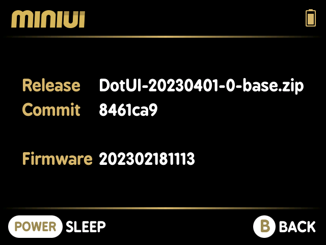
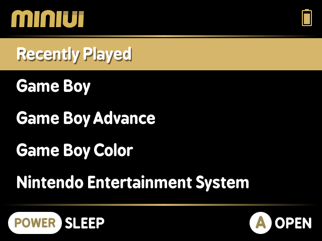
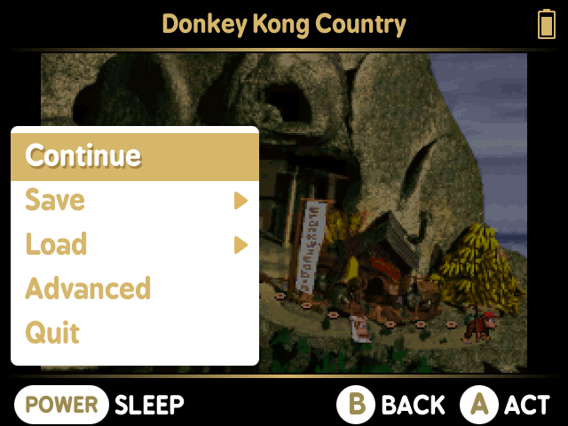

# BronzeDotUI

Fork of DotUI with color change back to original MiniUI bronze color.

  

# Additions:
Include SUPA and MGBA emulators by default

Favorites feature - save up to 5 favorite roms

# Install
To install or update follow included README after downloading the latest release
